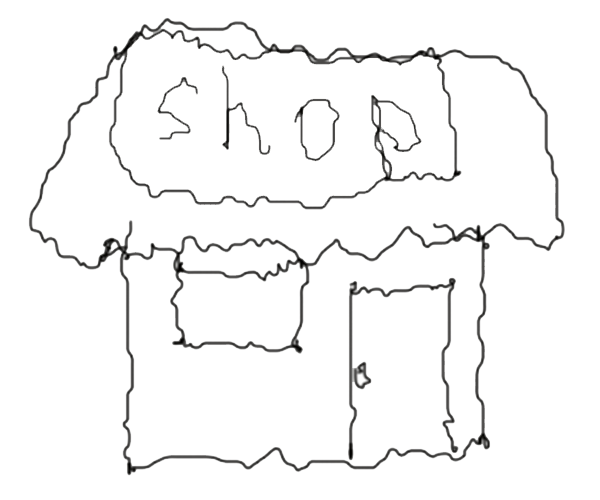
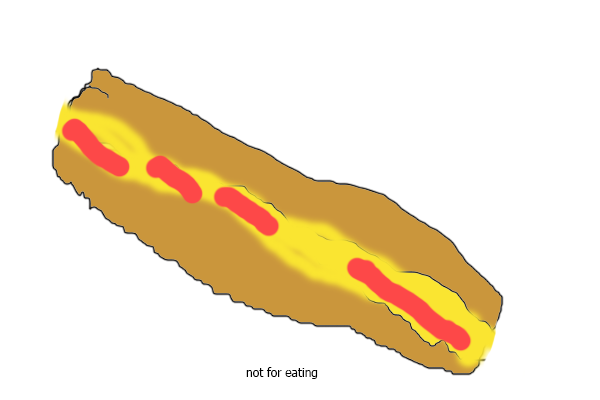
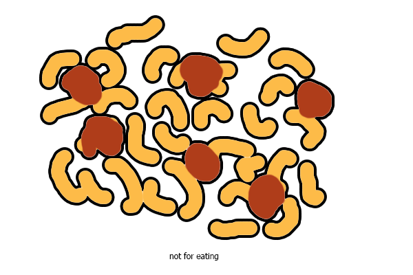
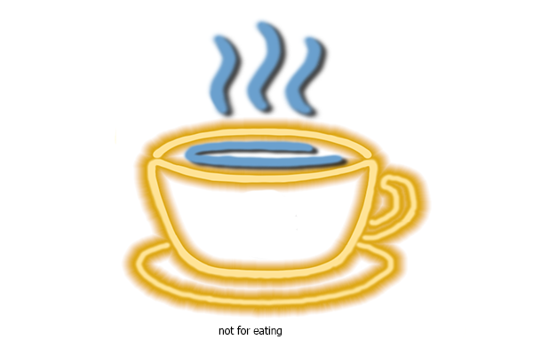

<!DOCTYPE html>
<html lang="en">
<head>
	<meta charset="UTF-8">
	<meta name="viewport" content="width=device-width, initial-scale=1">
	<link rel="stylesheet" href="css/bootstrap.css">
	<title>HelloShop</title>
	<link rel="stylesheet" href="style.css">
	<link rel="icon" href="file:///C:/Users/User/Desktop/try/images/images.png">
	<link href="https://fonts.googleapis.com/css2?family=Caveat:wght@400;500;600;700&family=Shizuru&display=swap" rel="stylesheet">
	<link rel="stylesheet" href="font/css/font-awesome.min.css">
</head>
<body>

	

	

		

		  

		  
		

		<nav>
			<ul>
				<li><a href="#header">Home</a></li>
				<li><a href="#products">Products</a></li>
				<li><a href="#bottom">About</a></li>
				<li><a href="#bottom">Contact</a></li>
				<li><a href="#bottom">Account</a></li>
			</ul>
			
		</nav>
	

	

		

			<h1>Welcomm</h1>
			
This is a shop. I don't know anything else. This is my first website.

			<a href="#products" class="btn">Explore &#8594;</a>
		

		

			
		

	

	

<!------- Categories -------->
	

	

		<h2 class="title">Categories</h2>
		

		

			

				
				<h3>Snacks</h3>
			

			

				
				<h3>Food</h3>
			

			

				
				<h3>Drinks</h3>
			

		

		

	
	
	

	
 <!----------products-------------------------------->
	

		<h2 class="title">Featured Products</h2>
		

			

				
				<h4>&nbsp;Sandwich</h4>
				

					<i class="fa fa-star"></i>
					<i class="fa fa-star-half-o"></i>
					<i class="fa fa-star-o"></i>
					<i class="fa fa-star-o"></i>
					<i class="fa fa-star-o"></i>
				

				
$0.75

			

			

				
				<h4>&nbsp;Macaroni</h4>
				

					<i class="fa fa-star"></i>
					<i class="fa fa-star"></i>
					<i class="fa fa-star"></i>
					<i class="fa fa-star"></i>
					<i class="fa fa-star-o"></i>
				

				
$2.50

			

			

				
				<h4>&nbsp;Coffee</h4>
				

					<i class="fa fa-star"></i>
					<i class="fa fa-star"></i>
					<i class="fa fa-star"></i>
					<i class="fa fa-star-half-o"></i>
					<i class="fa fa-star-o"></i>
				

				
$2.00

			

			

				
				<h4>&nbsp;Panini</h4>
				

					<i class="fa fa-star"></i>
					<i class="fa fa-star-half-o"></i>
					<i class="fa fa-star-o"></i>
					<i class="fa fa-star-o"></i>
					<i class="fa fa-star-o"></i>
				

				
$0.75

			

		
	
	

	
  <!--------footer--->
    

	

        
<h1>HelloShop</h1>

			<h2>Eat something</h2>
            
Copyright @ 2022 hi im kazakh. All rights reserved

        

	

</body>
</html>
